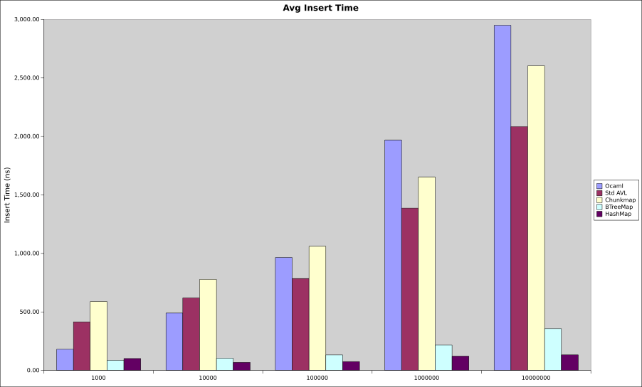
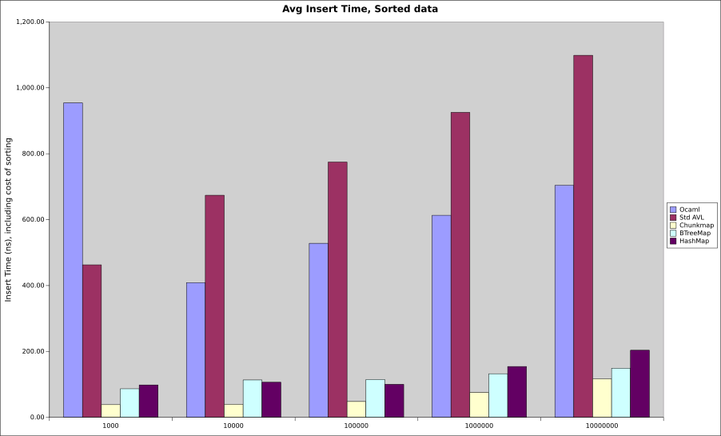

# immutable chunk map

A cache efficient immutable map with lookup performance equivalent to BTreeMap,
and reasonably good insertion performance (for a persistent structure).

A graph of lookup performance of various data structures using i64 keys. Full
test data in the results.gnumeric spreadsheet. Tests performed on an Intel Core
i7 6700HQ under Linux, cpu frequency governor 'performance'.

* OCaml: core map (from the Jane Street core library), an AVL tree with
distinct leaf nodes and a relaxed balance constraint.
* Std Avl: a classical AVL tree map from the 'immutable-map' cargo package
* Chunkmap: this library
* BTreeMap: from the Rust standard library
* Binary Search: binary search in a sorted array of keys
* HashMap: from the Rust standard library
* Array: random access to a Vec

Chunkmap is very close to BTreeMap, and binary search, which is probably optimal
for random accesses using keys without hashing. Obviously if you don't need
ordered data use a HashMap or even a Vec.

Single insertion is slightly more expensive than a classical AVL tree, however
multi insertion modes can significantly reduce this overhead. Anyway, if you
care a lot about insertion performance you really shouldn't use a persistent
data structure, as you pay a heavy price compared to a mutable one.

However in one very specific case, inserting into a chunkmap can be faster than
even a HashMap. If you have a lot of data to add at once (at least 10% of what's
already in the map), then you can sort it first, and use add_sorted, which is
much faster than add. The graph below shows building maps from scratch using
sorted data, which is the best possible case.

