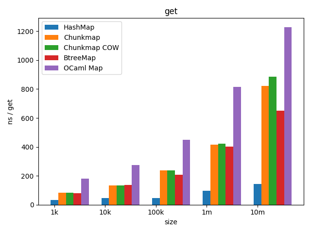
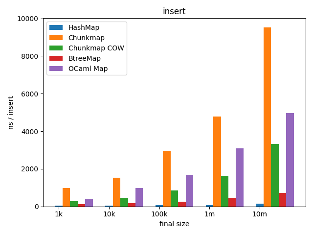

# immutable chunk map

A cache efficient immutable map, written using only safe rust, with
lookup performance close to BTreeMap and reasonably good insertion
performance. Optional copy on write mutable operations bring
modification performance within 2x of BTreeMap in the best case while
still offering snapshotting, and big O efficient set operations of a
persistant data structure.

A graph of lookup performance of various data structures using usize
keys. Full test data in the bench/charts directory. Tests performed on
an Intel Core i7 8550U under Linux with a locked frequency of 1.8 GHz.

* OCaml: core map (from the Jane Street core library), an AVL tree
  with distinct leaf nodes and a relaxed balance constraint.
* Chunkmap: this library
* Chunkmap COW: this library using only COW operations
* BTreeMap: from the Rust standard library
* HashMap: from the Rust standard library

Chunkmap is very close to BTreeMap for random accesses using keys
without hashing. Obviously if you don't need ordered data use a
HashMap.

Insertion performance, while not as good as most mutable data
structures, is not awful when using COW mode exclusively. In the case
where you have many updates to do at once you can go even faster by
using insert_many. In some cases, e.g. building a map from scratch
using sorted inputs this can be faster than even a HashMap. The below
case is more typical, adding 10% of a data set to the map.

A note about the COW bar on this graph. It represents using only
mutable COW operations on the map, it is perfectly possible to use an
actual insert_many call instead of mutable COW operations if it's
faster in your application, which as you can see, depends on the size
of the map.
